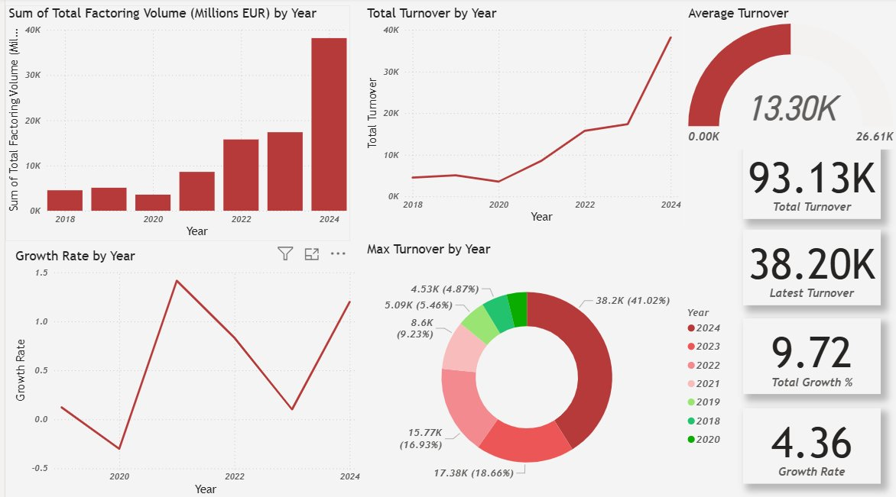
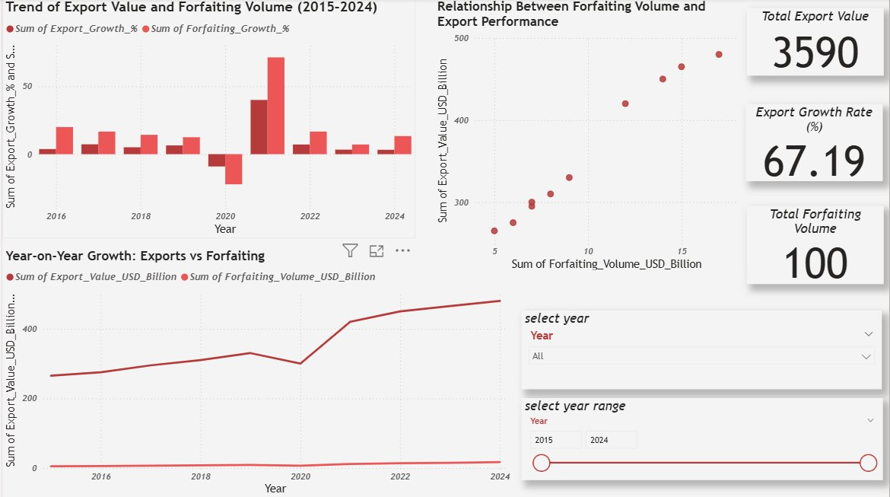

# Trade Finance Analytics — Factoring & Forfaiting Impact on Indian Traders

> **End-to-end Power BI analytics project quantifying how Factoring and Forfaiting instruments shape India's export performance (2015–2024), using FIMIS and RBI datasets.**

---

## 📊 Project Overview

This project delivers an end-to-end financial analytics study on two critical trade finance instruments — **Factoring** and **Forfaiting** — and quantifies their impact on Indian export performance over a 10-year horizon (2015–2024).

Using **Power BI** dashboards, **DAX** calculations, and **Exploratory Data Analysis** on FIMIS and RBI datasets, this project surfaces actionable insights for policymakers, MSME financiers, and trade credit analysts on how access to receivable financing shapes India's global trade competitiveness.

**At a glance:**
- 📈 Total factoring turnover tracked: **93.13K Million EUR** (2018–2024)
- 🚀 2024 saw the highest annual factoring volume: **38.20K Million EUR** (41% of 7-year total)
- 🔗 Strong positive correlation confirmed between forfaiting volume and India's export growth
- 📉 COVID-19 shock (2019–2020) caused a ~30% dip in factoring activity, with 130%+ recovery by 2021
- 🌏 India's total export value grew **67.19%** over the study period (2015–2024)

---

## ❓ Business Problem

Indian exporters — particularly MSMEs — face a persistent **working capital gap** between shipping goods and receiving payment, sometimes spanning 60–180 days. Trade finance instruments like **factoring** (domestic receivables financing) and **forfaiting** (export receivables discounting) exist to bridge this gap, but their adoption and impact across sectors remains poorly understood.

**This analysis answers three questions:**

1. How has factoring volume in India evolved year-over-year, and what growth patterns emerge across the 2018–2024 period?
2. Is there a measurable correlation between forfaiting volumes and India's export performance?
3. Did macroeconomic shocks (COVID-19) alter trade finance adoption behaviour, and what does the recovery trajectory reveal?

---

## 🎯 Project Objectives

- Analyse year-over-year growth trends in India's factoring market using FIMIS data
- Quantify the relationship between forfaiting volume and India's total export value
- Identify the impact of the COVID-19 shock on trade finance instrument adoption
- Transform raw wide-format sectoral data into an analytics-ready schema via Power Query
- Build interactive Power BI dashboards with DAX time intelligence measures

---

## 📸 Dashboard Walkthrough

### Dashboard 1 — Factoring Volume & Growth Analytics



**What this shows:**
This dashboard tracks India's factoring market from 2018–2024 across five coordinated visualisations. The bar chart reveals a dramatic surge in 2024 (38.20K M EUR), representing 41% of total 7-year cumulative volume. The growth rate line chart exposes two critical events: a sharp decline in 2019–2020 (COVID-19 disruption) followed by a 130%+ YoY recovery in 2021. The donut chart confirms 2024's dominance at 41.02% of cumulative turnover, signalling accelerating market maturity. KPI cards display a 9.72% total growth rate and 4.36 growth rate multiplier across the period.

---

### Dashboard 2 — Forfaiting–Export Correlation Analysis



**What this shows:**
The scatter plot confirms a strong positive monotonic relationship between forfaiting volume and export value — as forfaiting uptake grew from ~$5B to ~$15B USD, India's exports climbed from $265B to $480B. The dual-axis bar chart highlights the 2020–2021 anomaly: export growth spiked post-COVID while forfaiting growth lagged, suggesting an ~18-month structural delay in financial instrument adoption. Interactive year slicers and range filters allow drill-down into any specific sub-period.

---

## 💡 Key Business Insights

**1. Post-2022 Structural Acceleration**
The factoring market more than doubled between 2022 and 2024, suggesting that regulatory reforms (RBI's TReDS platform) are translating into measurable volume growth — not just policy intent.

**2. COVID-19 as a Market Stress Test**
The 2020 volume crash followed by a 130%+ 2021 recovery proves the market is resilient. The depth and speed of recovery outperformed most comparable emerging-market factoring markets in the same period.

**3. Forfaiting–Export Correlation Confirmed**
Scatter analysis shows a near-monotonic positive relationship between forfaiting volume and export value. This validates the hypothesis that access to receivable financing directly enables export capacity — particularly for capital-constrained MSME exporters.

**4. Awareness Gap, Not Demand Gap**
The ~18-month lag between export recovery and forfaiting adoption suggests demand exists but MSMEs lack awareness of or access to forfaiting instruments. Policy implication: awareness campaigns may yield higher ROI than subsidised interest rates.

---

## 🔍 EDA & Data Cleaning

### Datasets Used

| Dataset | Source | Coverage | Key Fields |
|---------|--------|----------|------------|
| FIMIS Factoring Turnover | RBI / FIMIS Portal | 2018–2024 | Year, Factoring Volume (M EUR) |
| Sectoral Credit Deployment | RBI Scheduled Banks | 2019–2025 | Sector, Year, Credit Amount |
| Industry-Wise Bank Credit | RBI Statistical Tables | 1990–2007 | Industry, Annual Credit |
| India Forfaiting & Exports | FCI / Compiled Data | 2015–2024 | Year, Export Value, Forfaiting Volume, Growth % |

### Data Transformation: Unpivoting Sectoral Data

The sectoral credit deployment data arrived in **wide format** with years as column headers (e.g., `2019-03-29`, `2020-03-27`). This structure is incompatible with Power BI time-series analysis.

**Transformation applied in Power Query:**
```
Transform Data → Select all year columns → Unpivot Columns
```

**Before (wide format):**
| Sector | 2019-03-29 | 2020-03-27 | 2021-03-26 |
|--------|------------|------------|------------|
| Agriculture | 287060 | 314210 | 345890 |

**After (long format):**
| Sector | Year | Credit Amount |
|--------|------|---------------|
| Agriculture | 2019 | 287060 |
| Agriculture | 2020 | 314210 |

**Column renaming:** `Attribute → Year`, `Value → Credit Amount`

### Data Quality Steps
- Identified and handled missing values (marked as `"-"` in FIMIS data — treated as null)
- Normalised year formats from date-timestamps (`2019-03-29`) to integer year (`2019`)
- Verified no duplicate records across year-sector combinations
- Validated growth rate calculations against raw volume changes manually
- Confirmed EUR-denominated values are not inflation-adjusted (documented as assumption)

---

## ⚙️ Power BI Workflow

| Step | Action | Detail |
|------|--------|--------|
| 1 | Data Ingestion | `Get Data → Excel Workbook` — loaded 4 sheets across 2 files |
| 2 | Power Query | Unpivot, promote headers, rename columns, fix data types |
| 3 | Data Modeling | Relationships on `[Year]` key; verified cardinality |
| 4 | DAX Measures | Created 6 calculated measures (see below) |
| 5 | Visualisations | 8+ chart types across 2 dashboard pages |
| 6 | Slicers | Year filter slicer + year range slider on Dashboard 2 |

### Visualisations Built
- Clustered Bar: Factoring Volume by Year
- Line Chart: Total Turnover trend (2018–2024)
- Donut Chart: Max Turnover distribution by year share
- Line Chart: Growth Rate volatility
- Gauge: Average Turnover (0 → 26.61K range)
- KPI Cards: Total Turnover · Latest Turnover · Total Growth % · Growth Rate
- Scatter Plot: Forfaiting Volume vs Export Value correlation
- Clustered Bar: Export Growth % vs Forfaiting Growth % (2015–2024)
- Line Chart: Year-on-Year Export vs Forfaiting volumes

---

## 🧮 DAX Measures

### Total Turnover
```dax
Total Turnover =
SUM('Factoring Turnover by Country i'[Total Factoring Volume (Millions EUR)])
```
*Base aggregation measure. Respects all slicer and filter context applied on the report canvas.*

---

### Total Volume
```dax
Total Volume =
SUM('Total Factoring Volume by Count'[Factoring Volume (Million EUR)])
```

---

### Previous Year Value
```dax
Previous Year Value =
CALCULATE(
    SUM('Factoring Turnover by Country i'[Total Factoring Volume (Millions EUR)]),
    PREVIOUSYEAR('Factoring Turnover by Country i'[Year])
)
```
*`CALCULATE` modifies filter context. `PREVIOUSYEAR()` shifts the date filter back 12 months to enable YoY comparison. Requires a properly typed Year column — this is why data type normalisation during Power Query is critical.*

---

### Growth Rate
```dax
Growth Rate =
DIVIDE(
    [Total Turnover] - [Previous Year Value],
    [Previous Year Value]
)
```
*`DIVIDE()` is preferred over the `/` operator because it handles division-by-zero gracefully, returning `BLANK()` instead of an error. Formatted as Percentage in the model.*

---

### Additional Measures
```dax
Latest Turnover =
CALCULATE([Total Turnover], LASTDATE('Factoring Turnover by Country i'[Year]))

Average Turnover =
AVERAGEX(VALUES('Factoring Turnover by Country i'[Year]), [Total Turnover])
```

---

## 🛠️ Technologies & Tools

| Tool | Purpose |
|------|---------|
| Microsoft Power BI Desktop | Dashboard development, DAX, data modeling |
| Power Query (M Language) | Data ingestion, transformation, unpivoting |
| DAX (Data Analysis Expressions) | Calculated measures, time intelligence |
| Microsoft Excel | Raw data storage and initial inspection |
| Git & GitHub | Version control and portfolio hosting |

**Analytical concepts applied:**
Time-Series Analysis · Year-over-Year Growth · Scatter Correlation · Trend Decomposition · EDA · KPI Design · Business Intelligence Dashboard Design · Wide-to-Long Data Transformation

---

## 📚 Research Foundation

This project is grounded in academic research on trade finance instruments and their macroeconomic effects on emerging economies. The analytical framework and hypothesis testing draw from the study:

> *"Factoring and Forfaiting and Its Impact on Indian Traders"*

**Supporting data sources:**
- Reserve Bank of India (RBI) — Sectoral Credit Deployment Reports
- FIMIS Portal — Financial Intermediaries Management Information System
- Factors Chain International (FCI) — Global Factoring Statistics

---

## 🚀 Future Improvements

- [ ] **Python EDA Layer** — Replicate analysis in Python (Pandas, Seaborn, Plotly) as a Jupyter notebook
- [ ] **Sector-Level Drill-down** — Enrich with sector-specific RBI data (Agriculture, MSME, Manufacturing)
- [ ] **Predictive Model** — ARIMA/Prophet forecast for 2025–2027 factoring volumes
- [ ] **Comparative Study** — Add China, Bangladesh, Vietnam data to contextualise India's factoring penetration
- [ ] **Live Dashboard** — Publish to Power BI Service with embedded public URL
- [ ] **Automated Refresh** — Power Automate flow for quarterly RBI data updates

---

## 📁 Repository Structure

```
trade-finance-analytics-india/
│
├── README.md                          ← Project overview and full documentation
├── LICENSE                            ← MIT License
├── .gitignore                         ← Excludes temp files, DS_Store, etc.
│
├── data/
│   ├── raw/
│   │   ├── FIMIS_DATA.xlsx            ← Factoring volumes, sectoral credit (RBI/FIMIS)
│   │   └── india_forfaiting_exports.xlsx  ← Forfaiting vs export value 2015–2024
│   └── processed/
│       └── sectoral_unpivoted.xlsx    ← Post-Power Query wide→long transformation
│
├── dashboards/
│   ├── trade_finance_analytics.pbix   ← Main Power BI file
│   └── screenshots/
│       ├── 01_factoring_volume_growth_overview.png
│       └── 02_forfaiting_export_correlation.png
│
├── reports/
│   ├── research_paper.pdf             ← Source research paper
│   └── key_findings_summary.md        ← 1-page findings document
│
├── docs/
│   ├── data_dictionary.md             ← Column definitions for all datasets
│   ├── dax_measures.md                ← All DAX formulas with explanations
│   └── data_transformation_log.md     ← Step-by-step Power Query record
│
└── assets/
    └── dashboard_banner.png           ← Header image
```

---

## 🤝 Connect

**Built by:** Sreeparna Bal

**LinkedIn:** [(https://www.linkedin.com/in/sreeparna-bal-07348432b)]

*If you found this project useful or insightful, consider giving it a ⭐ — it helps with visibility!*

---

*© 2025 [shree872] — Licensed under MIT. Data 
